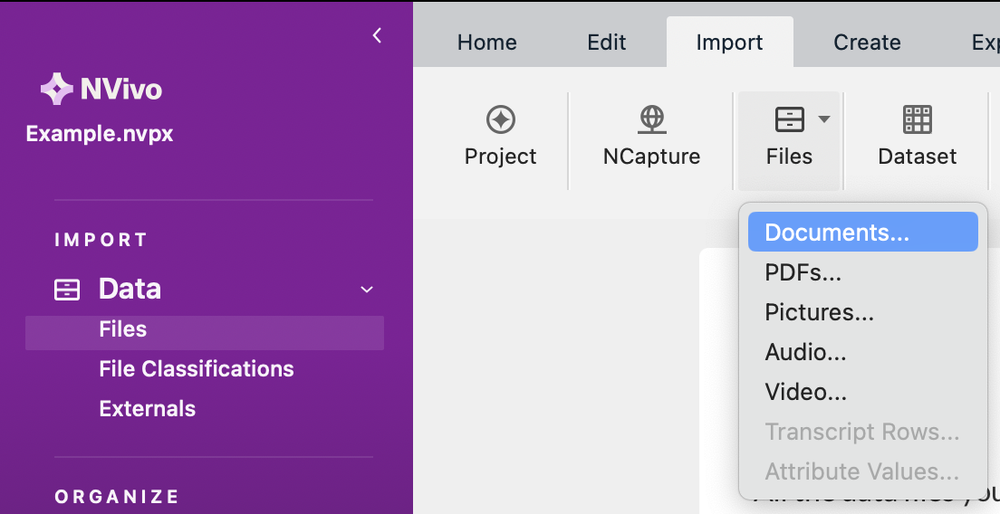
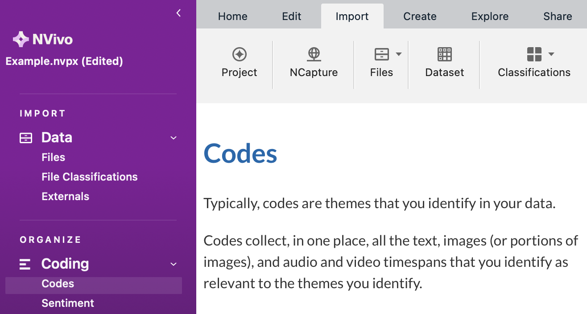
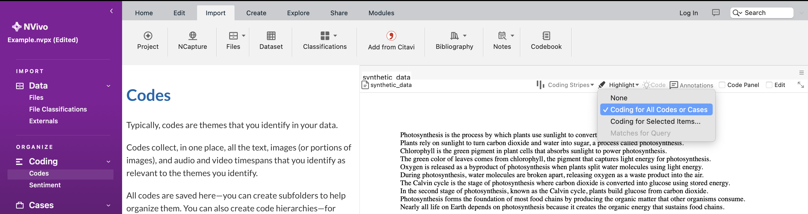
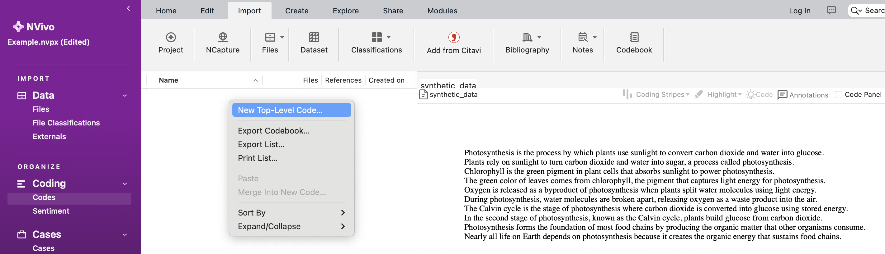
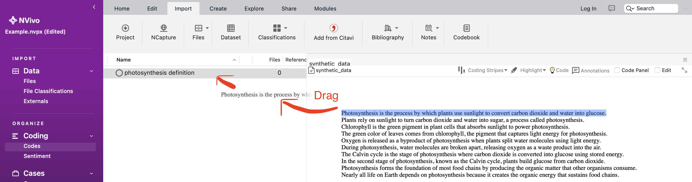
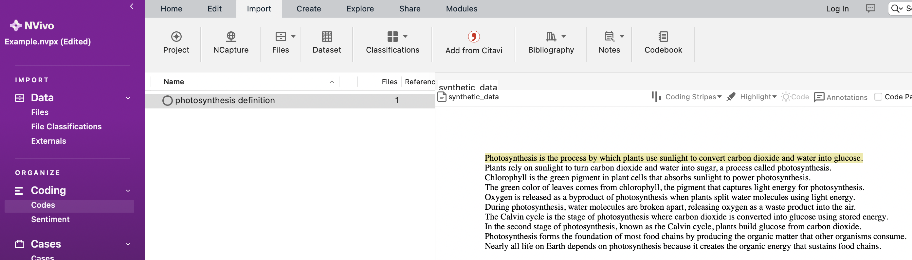
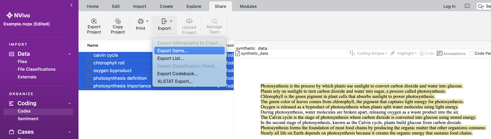
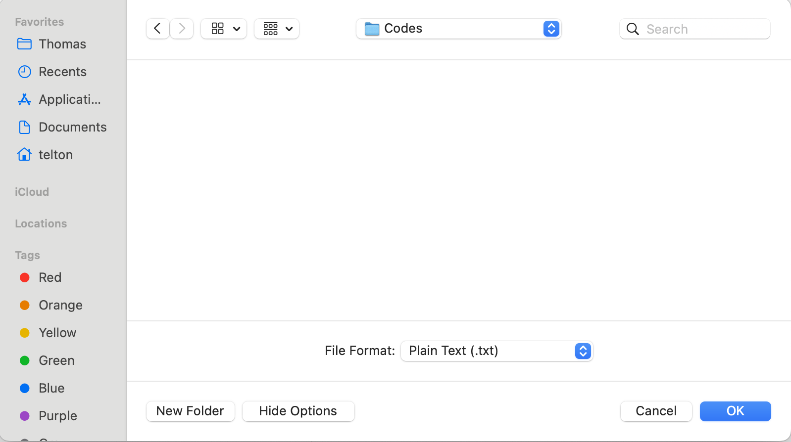
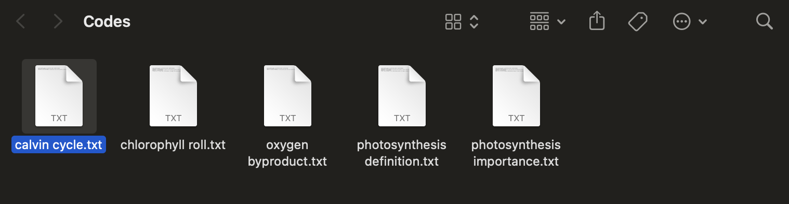

# Process for Clustering in NVivo

To do the clustering, we will be using NVivo. At the time of writing, staff at the University of Sydney can use NVivo for free (see the Service Portal).

> Note (if other people may stumble on this repo). When making this tutorial, I forgot that the python script as it exists works for a very specific circumstance. It assumes that there is a primary key in brackets at the end of the sentence. For example, "This is a sentence. (1)". If it does not follow this format, the code will break. With that being said, the example below does not work, but should be sufficient for my supervisor reading this (our data does have the primary key at the end in brackets).

1. Create a new NVivo file. When open, go to Import > Files > Documents, and then find the txt file (or document) you want to upload and press "Import".

2. Navigate to the Codes tab.

3. Ensure that you switch highlighting to be "Coding for All Codes or Cases".

4. Look at the sentences, and think about what the first cluster is and what it should be named. Once you have decided, in the left-hand strip, right-click and press "New Top-Level Code...". Give that code a name.

5. Highlight ONE sentence that you want to include in that code. Drag it into the code on the left.

6. One a sentence has been clustered, it will be highlighted yellow.

6. Continue the clustering process. This is my process:

- Go through all the sentences first, and make a new cluster any time I see that two sentences will belong together. When doing this, I purposefully leave sentences that do not belong in a cluster by themselves.

- Scroll up to the top of the text file for a second pass. This time, I only look at the sentences that are not highlighted yellow. If they are not highlighted yellow, this means that I missed that sentence in my first pass. I will now see if I can add those sentences to an existing cluster, or if I should create new clusters to contain sentences that should be together. If it is obvious that a sentence will be in a solo cluster, then it is fine to not create a new cluster in NVivo for it. They python script later will manually make clusters for left-over sentences. This behaviour is intended so that the codes in NVivo are more manageable.

7. When you are done, in the panel that shows all the codes, press command+A (or control+A) to select all the clsuters (they should be highlighted blue when selected).

8. Navigate to Share > Export > Export Items... (NB: in the clustering example in the iamges, I have intentionally made mistakes in the clustering to illustrate the notion of leaving sentences by themselves)

9. I recommend making a new folder called Codes to contain the NVivo output. Click on "Show Options" and set the file format to "Plain Text (.txt)". When finished, press "Ok".

10. The output from step 9 creates a text file for each code in NVivo.

11. Now you are ready to run the python script to generate a csv file. To run the python script, enter `python3 generate_csv_NVivo_clustering.py "<text_file_uploaded_to_NVivo.txt>" --codes-dir "<directory_to_get_to_codes_from_step_9>" --csv-output "<file_name_for_produced_csv.csv>"`

